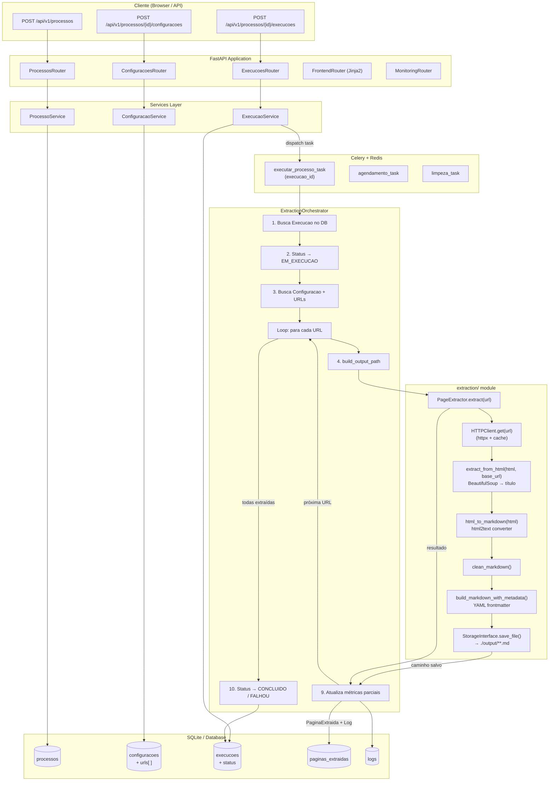

```mermaid
flowchart TD
    subgraph CLIENT["Cliente (Browser / API)"]
        A1["POST /api/v1/processos"]
        A2["POST /api/v1/processos/{id}/configuracoes"]
        A3["POST /api/v1/processos/{id}/execucoes"]
    end

    subgraph FASTAPI["FastAPI Application"]
        B1["ProcessosRouter"]
        B2["ConfiguracoesRouter"]
        B3["ExecucoesRouter"]
        B4["FrontendRouter (Jinja2)"]
        B5["MonitoringRouter"]
    end

    subgraph SERVICES["Services Layer"]
        C1["ProcessoService"]
        C2["ConfiguracaoService"]
        C3["ExecucaoService"]
    end

    subgraph DB["SQLite / Database"]
        D1[("processos")]
        D2[("configuracoes\n+ urls[ ]")]
        D3[("execucoes\n+ status")]
        D4[("paginas_extraidas")]
        D5[("logs")]
    end

    subgraph QUEUE["Celery + Redis"]
        E1["executar_processo_task\n(execucao_id)"]
        E2["agendamento_task"]
        E3["limpeza_task"]
    end

    subgraph ORCHESTRATOR["ExtractionOrchestrator"]
        F1["1. Busca Execucao no DB"]
        F2["2. Status → EM_EXECUCAO"]
        F3["3. Busca Configuracao + URLs"]
        F4["Loop: para cada URL"]
        F5["4. build_output_path"]
        F6["9. Atualiza métricas parciais"]
        F7["10. Status → CONCLUIDO / FALHOU"]
    end

    subgraph EXTRACTION["extraction/ module"]
        G1["PageExtractor.extract(url)"]
        G2["HTTPClient.get(url)\n(httpx + cache)"]
        G3["extract_from_html(html, base_url)\nBeautifulSoup → título"]
        G4["html_to_markdown(html)\nhtml2text converter"]
        G5["clean_markdown()"]
        G6["build_markdown_with_metadata()\nYAML frontmatter"]
        G7["StorageInterface.save_file()\n→ ./output/**.md"]
    end

    A1 --> B1 --> C1 --> D1
    A2 --> B2 --> C2 --> D2
    A3 --> B3 --> C3
    C3 --> D3
    C3 -->|"dispatch task"| E1

    E1 --> F1
    F1 --> F2 --> F3 --> F4
    F4 --> F5 --> G1
    G1 --> G2 --> G3 --> G4 --> G5 --> G6 --> G7
    G7 -->|"caminho salvo"| F6
    G1 -->|"resultado"| F6
    F6 -->|"PaginaExtraida + Log"| D4
    F6 --> D5
    F6 -->|"próxima URL"| F4
    F4 -->|"todas extraídas"| F7
    F7 --> D3


```
